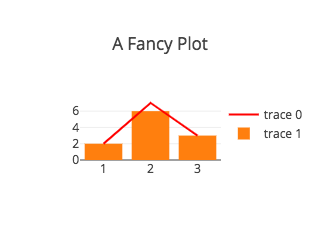

# vue-plotly.js


> A [plotly.js](https://github.com/plotly/plotly.js) Vue component.
> Heavily inspired and based on [react-plotly.js](https://github.com/plotly/react-plotly.js)

## Installation

```
$ npm install vue-plotly.js plotly.js
```

## Quick start

The easiest way to use this component is to import and pass data to a plot component. To import the component,

```javascript
import Plot from 'vue-plotly.js';
```

Then to render a plot

```javascript
<template>
  <Plot
    :data="data"
    :layout="layout"
  />
</template>

<script>
import Plot from 'vue-plotly.js';

export default {
  name: 'Example',
  components: {
    Plotly,
  },
  data: () => ({
    data: [
      {
        type: 'scatter',
        mode: 'lines+points',
        x: [1, 2, 3],
        y: [2, 6, 3],
        marker: {color: 'red'}
      },
      {
        type: 'bar',
        x: [1, 2, 3],
        y: [2, 5, 3]
      }
    ],
    layout: {
      width: 320,
      height: 240,
      title: 'A Fancy Plot'
    },
  }),
};
</script>
```

You should see a plot like this:

<p align="center">
  
</p>

For a full description of Plotly chart types and attributes see the following resources:

* [Plotly JavaScript API documentation](https://plot.ly/javascript/)
* [Full plotly.js attribute listing](https://plot.ly/javascript/reference/)

## Customizing the `plotly.js` bundle

By default, the `Plot` component exported by this library loads a precompiled version of all of `plotly.js`, so `plotly.js` must be installed as a peer dependency. This bundle is around 6Mb unminified, and minifies to just over 2Mb.

If you do not wish to use this version of `plotly.js`, e.g. if you want to use a [different precompiled bundle](https://github.com/plotly/plotly.js/blob/master/dist/README.md#partial-bundles) or if your wish to [assemble you own customized bundle](https://github.com/plotly/plotly.js#modules), or if you wish to load `plotly.js` [from a CDN](https://github.com/plotly/plotly.js#use-the-plotlyjs-cdn-hosted-by-fastly), you can skip the installation of as a peer dependency (and ignore the resulting warning) and use the `createPlotComponent` method to get a `Plot` component, instead of importing it:

```javascript
// simplest method: uses precompiled complete bundle from `plotly.js`
import Plot from 'vue-plotly.js';

// customizable method: use your own `Plotly` object
import createPlotlyComponent from 'vue-plotly.js/factory';
import Plotly from './custom-plotly-bundle.js';
const Plot = createPlotlyComponent(Plotly); // creates a Vue component
```

## Development

To get started:

```
$ npm install
```

Running example from `/example`

```
$ npm run dev
```

## License
© 2017 BrewBlox, MIT License.
